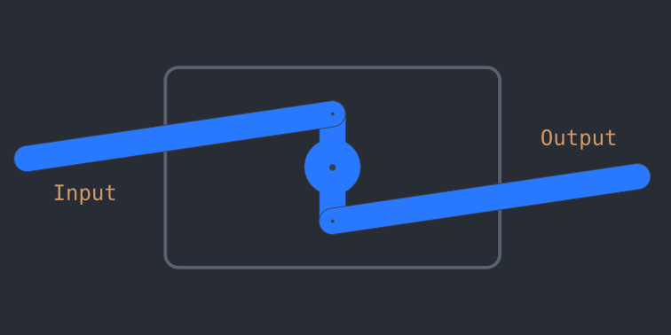

# clockwork computation

A language for specifying clockwork. 

## intro

If you haven't heard of the [Analytical Engine](https://en.wikipedia.org/wiki/Analytical_Engine),
it may surprise you to learn that it's possible to build a full, Turing complete, general purpose computer using just mechanical parts.

This little language gives you three components: Rods, gears, and springs. Now, if we want some digital logic, we need some definitions.
A rod can either be pushed (to the right) or pulled (to the left). We can use these like 0 and 1 in binary.
Let's say a pushed rod is 1 or true and a pulled rod is 0 or false.

Here's what a mechanical not gate looks like:



Clearly, if the input rod is pushed to the right, a one, the output rod is pulled to the left, so a zero.
And, if the rod is pulled to the left, a zero, the output rod is pushed to the right, so a one.
And what do you know, that's the truth table for a NOT gate!

Here's how that's implemented in the language

```js
component not {  // define a resuable component not
    input x: rod {  // define x, a rod that is an input
        x -> my_gear {
            attachmentPoint: 0 // attach x to the first tooth of my_gear
        }
    }

    my_gear: gear { // define my_gear, a gear with two teeth, i.e a spinning rod.
        teeth: 2
        gear -> y {
            attachmentPoint: 1 // attach y to the second tooth of the gear
        }
    }

    output y: rod {} // define y, an output rod
}
```

And here's an OR gate:

```js
component or {
    input x: rod {
        x -> joiner {
            attachmentType: push_only // If x is pushed, it pushes joiner, but if x is pulled, joiner remains where it is
        }
    }

    input y: rod {
        y -> joiner {
            attachmentType: push_only
        }
    }

    output joiner: rod {
        spring: pull // If nothing else pushes or pulls on joiner, a spring pulls it to the pull state. 
    }
}
```

Now this is very exciting, because if we put those together we've got a NOR gate!

```js
component nor {
    input x: rod {}
    input y: rod {}
    
    use or(x, y) -> p
    use not(p) -> q

    output q: rod {}
}
```

And as we all know, a NOR gate is a [universal gate](https://en.wikipedia.org/wiki/NOR_logic), meaning you can make _any_ logic circuit using just NOR gates.

